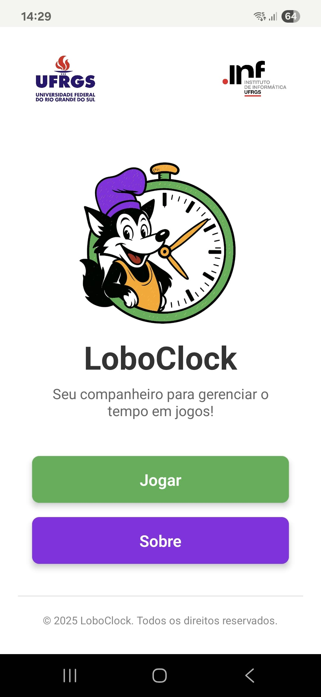
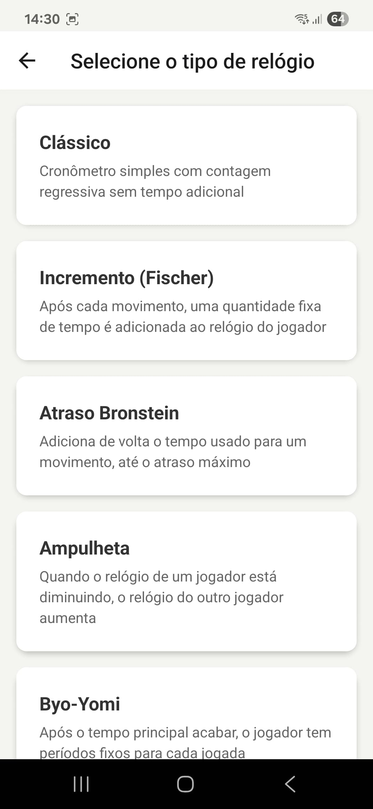
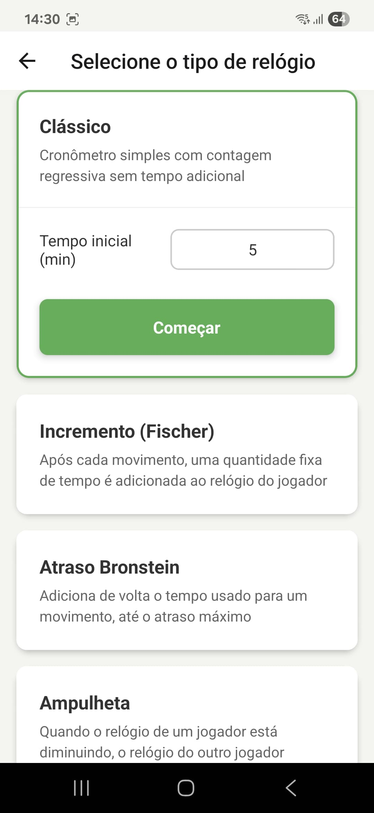
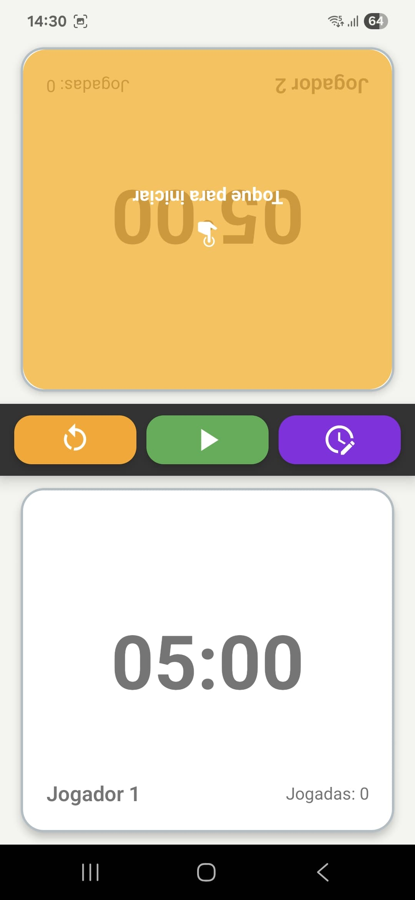
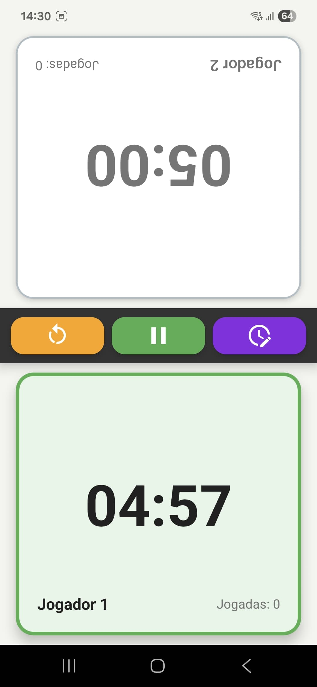

# LoboClock 🐺⏰

A modern, feature-rich chess clock application built with React Native and TypeScript. LoboClock provides multiple timing strategies for chess games, tournaments, and other turn-based activities. It was developed as a part of the LoBoGames project, which objective is to promote the interest in Logical Board Games, encouraging and cultivating logical reasoning among students.

## 📸 Screenshots

<div align="center">
  
  
  
  
  
</div>

## ✨ Features

- 🕐 **Multiple Timer Strategies** - Support for 8 different timing systems:
  - **Classical** - Simple countdown timer
  - **Increment** - Adds time after each move
  - **Bronstein Delay** - Delay before time starts counting
  - **Hourglass** - Time flows between players
  - **Byo-Yomi** - Japanese overtime system
  - **Canadian Overtime** - Group move overtime
  - **Tournament** - Multi-phase professional timing
  - **Custom** - Fully configurable timing rules

- 📱 **Cross-Platform** - Built with React Native for iOS, Android, and Web
- ⚡ **High-Precision Timing** - Accurate millisecond-level time tracking
- 🎨 **Intuitive Interface** - Clean, responsive design optimized for gameplay
- 🔧 **Configurable Settings** - Extensive customization for each timer type
- 📊 **Move Tracking** - Automatic move counting and phase transitions
- 🏆 **Tournament Ready** - Professional features for competitive play
- 🌟 **Modern Architecture** - TypeScript-powered with clean separation of concerns

## 📱 Usage

1. **Select Timer Type**: Choose from 8 different timing strategies
2. **Configure Settings**: Adjust time limits, increments, and special rules
3. **Start Game**: Player 2 taps their side to begin
4. **Switch Turns**: Active player taps their side to end their turn
5. **Pause/Resume**: Opponent taps to resume after a pause

## 🛠️ Technologies Used

- **React Native** - Cross-platform mobile development framework
- **TypeScript** - Type-safe JavaScript for reliable code
- **Expo** - Development platform and build system
- **React Navigation** - Navigation library for screen transitions
- **React Native Vector Icons** - Icon library for UI elements
- **React Native Picker** - Native picker components

## 🚀 Getting Started

### Prerequisites

- [Node.js](https://nodejs.org/) (version 14 or higher)
- [npm](https://www.npmjs.com/) or [yarn](https://yarnpkg.com/)
- [Expo CLI](https://docs.expo.dev/get-started/installation/) for development
- For iOS: Xcode (Mac only)
- For Android: Android Studio

### Installation

1. Clone the repository:
```bash
git clone https://github.com/MatheusDosAnjos/LoboClock.git
cd LoboClock
```

2. Install dependencies:
```bash
npm install
# or
yarn install
```

3. Start the development server:
```bash
npx expo start
# or
yarn expo start
```

4. Run on your preferred platform:
   - Press `i` for iOS simulator
   - Press `a` for Android emulator
   - Scan QR code with Expo Go app on your device


## 📦 Project Structure
```
LoboClock/
├── App.tsx                         # Root application component
├── app.json                        # Expo configuration
├── src/
│   ├── components/                 # Reusable UI components
│   │   └── TimerConfigForm.tsx
│   ├── controllers/                # Game logic controllers
│   │   └── GameController.ts
│   ├── factories/                  # Strategy factory pattern
│   │   └── TimerStrategyFactory.ts
│   ├── navigation/                 # Navigation configuration
│   │   └── AppNavigator.tsx
│   ├── screens/                    # Application screens
│   │   ├── GameScreen.tsx
│   │   ├── MainMenuScreen.tsx
│   │   ├── TimerSelectionScreen.tsx
│   │   └── AboutScreen.tsx
│   ├── strategies/                 # Timer strategy implementations
│   │   ├── TimerStrategy.ts
│   │   ├── ClassicalStrategy.ts
│   │   ├── IncrementStrategy.ts
│   │   ├── BronsteinDelayStrategy.ts
│   │   ├── HourglassStrategy.ts
│   │   ├── ByoYomiStrategy.ts
│   │   ├── CanadianOvertimeStrategy.ts
│   │   ├── TournamentStrategy.ts
│   │   └── CustomStrategy.ts
│   └── utils/                      # Utility functions
│       └── timeFormatter.ts
└── assets/                         # Images and static assets
    └── screenshots/                # Application screenshots
```

## 🏗️ Architecture
LoboClock uses a clean architecture with several design patterns:
- **Strategy Pattern**: Each timer type implements the `TimerStrategy` interface
- **Factory Pattern**: `TimerStrategyFactory` creates appropriate strategy instances
- **Controller Pattern**: `GameController` manages game state and timing logic
- **Component Pattern**: Reusable React components for UI elements

## 🤝 Contributing
Contributions are welcome! Please feel free to submit a Pull Request. For major changes, please open an issue first to discuss what you would like to change.
1. Fork the project
2. Create your feature branch (`git checkout -b feature/AmazingFeature`)
3. Commit your changes (`git commit -m 'Add some AmazingFeature'`)
4. Push to the branch (`git push origin feature/AmazingFeature`)
5. Open a Pull Request

### Development Guidelines
- Follow TypeScript best practices
- Maintain test coverage for new features
- Use the established design patterns
- Update documentation for new timer strategies

<!-- ## 📄 License -->

<!-- This project is open source and available under the [MIT License](LICENSE). -->

## 👨‍💻 Author
**Matheus Adam dos Anjos**
- GitHub: [@MatheusDosAnjos](https://github.com/MatheusDosAnjos)

## 🎯 Future Enhancements
- Sound notifications for time warnings
- Game history and statistics
- Favorite timers
- Custom themes and colors

## 📞 Support
If you encounter any issues or have questions:
- Open an issue on GitHub
- Check the documentation in the source code
- Contact through GitHub profile

---